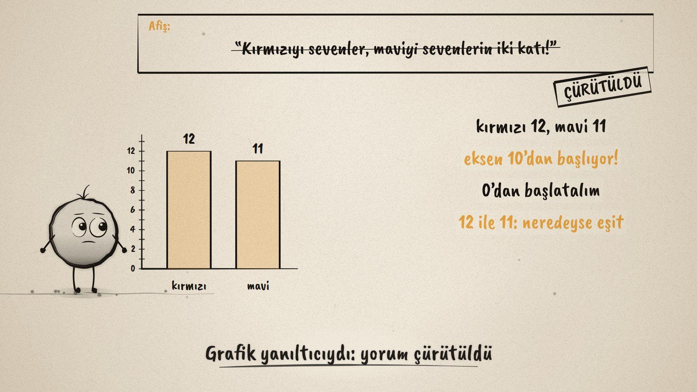
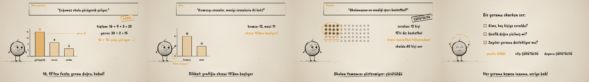

# Bu Yorum Doğru mu? · Is This Claim Right?

**▶ Tarayıcıda izleyin / Watch in the browser:** https://hakanatas.github.io/bu-yorum-dogru-mu/ 
**⬇ MP4 + altyazılar / MP4 + subtitles:** [Releases](https://github.com/hakanatas/bu-yorum-dogru-mu/releases) 
**✎ Kullanılan istem / The prompt behind it:** [PROMPT.md](PROMPT.md) 
**🎞 Bütün filmler / All films:** [Nokta'nın Filmleri](https://hakanatas.github.io/nokta-filmleri/)

> **TR —** 5. sınıf matematik "İstatistiksel Araştırma Süreci" temasındaki MAT.5.5.2 öğrenme çıktısı için hazırlanmış, tamamen JavaScript ile çizilen 92 saniyelik mürekkep animasyonu. Nokta, başkalarının kategorik veriye dayanarak yazdığı üç yorumu inceliyor. Okul gazetesi: "Çoğumuz okula yürüyerek geliyor." 30 kişinin yarısı 15, yürüyenler 16; sayılar yorumu destekliyor: KABUL. Afiş: "Kırmızıyı sevenler, maviyi sevenlerin iki katı!" Grafiğin ekseni 10'dan başlıyor; eksen 0'dan başlayınca 12 ile 11 neredeyse eşit: ÇÜRÜTÜLDÜ. Duyuru: "Okulumuzun en sevdiği spor: basketbol!" 60 kişilik okulda yalnızca basketbol takımındaki 12 kişiye sorulmuş; yanlı örneklem: ÇÜRÜTÜLDÜ. Film üç soruyla bitiyor: Kime, kaç kişiye soruldu? Grafik doğru çizilmiş mi? Sayılar yorumu destekliyor mu? Altyazılar Türkçe, İngilizce ya da ikisi birlikte seçilebilir.

A 92-second ink animation for **5th-grade maths**, drawn entirely with JavaScript on an HTML5 canvas. It is the second film of the *İstatistiksel Araştırma Süreci* theme, after [Veri Ne Diyor?](https://github.com/hakanatas/veri-ne-diyor). Nokta, the ink character from [The Learning Ink](https://github.com/hakanatas/the-learning-ink), is the guide again.

## Learning outcome

MEB, Türkiye Yüzyılı Maarif Modeli, Ortaokul Matematik, 5th grade, "İstatistiksel Araştırma Süreci" theme:

**MAT.5.5.2. Başkaları tarafından oluşturulan kategorik veriye dayalı istatistiksel sonuç veya yorumları tartışabilme**
- a) İstatistiksel temellendirme yapar.
- b) Hataları ya da yanlılıkları tespit eder.
- c) Sonuç veya yorumları çürütür ya da kabul eder.

## Scenes

| # | Time | Scene | What happens | Outcome |
|---|---|---|---|---|
| 1 | 0–10 s | Doğru mu? | When you hear a claim, ask: is it right? | Intro |
| 2 | 10–30 s | Gazete: kabul | "Çoğumuz okula yürüyerek geliyor." 16 + 9 + 5 = 30, half is 15, 16 > 15. The numbers support it: accepted. | a, c |
| 3 | 30–52 s | Afiş: yanıltıcı grafik | "Kırmızıyı sevenler, maviyi sevenlerin iki katı!" The axis starts at 10. When it starts at 0, 12 and 11 are almost equal: refuted. | b, c |
| 4 | 52–72 s | Duyuru: yanlı örneklem | "Okulumuzun en sevdiği spor: basketbol!" Only 12 of the school's 60 students were asked, all from the basketball team: biased, refuted. | b, c |
| 5 | 72–82 s | Üç soru | Who and how many were asked? Is the graph drawn correctly? Do the numbers support the claim? | a–c |
| 6 | 82–92 s | Aklında kalsın | Gazette: accepted; poster and notice: refuted. "Her yoruma hemen inanma, veriye bak!" | Wrap-up |

## Running it

- **Preview:** double-click `index.html` (it works offline).
- **MP4:** run `npm install` once, then `npm run export -- --format=horizontal --captions=tr`.
- **Subtitles and narration:** `npm run srt` writes `out/captions_*.srt` and `narration_notes.txt`.
- **Editing:**
  - Caption text, timings and narration notes: `captions.js`
  - Everything on screen is drawn by `LI.world(t)` in `scenes/scene1.js` (claim cards, charts, reasoning lines, the school, the checklist); the other scenes only set the camera.
  - The claims (`CLAIMS`), bar charts (`bars`), stamps (`stamp`) and Nokta's poses: `src/draw/film.js`; layout for 16:9 and 9:16: `src/draw/kd.js`

It uses the same engine as The Learning Ink: `renderFrame(t)` as a pure function of time, seeded randomness, and frame-by-frame export.

## Lisans · License

**TR —** Bu film ve kodu [Creative Commons Atıf-GayriTicari 4.0 Uluslararası (CC BY-NC 4.0)](https://creativecommons.org/licenses/by-nc/4.0/deed.tr) lisansıyla paylaşılır. Ticari olmayan her amaçla (derste, okulda, eğitim materyalinde) kopyalayabilir, paylaşabilir ve değiştirebilirsiniz; ancak **kaynak göstermek zorunludur**: eser sahibinin adı ve bu deponun bağlantısı belirtilmeden kullanılamaz. Ticari kullanım (satış, ücretli ürün ya da yayın) için izin alınmalıdır.

**EN —** This film and its code are licensed under [Creative Commons Attribution-NonCommercial 4.0 International (CC BY-NC 4.0)](https://creativecommons.org/licenses/by-nc/4.0/). You may copy, share and adapt them for non-commercial purposes, but **attribution is required**: they may not be used without crediting the author and linking to this repository. Commercial use requires permission.

Atıf örneği / Required credit: *“Bu Yorum Doğru mu?”, Hakan Ataş, Nokta'nın Filmleri — https://github.com/hakanatas/bu-yorum-dogru-mu — CC BY-NC 4.0*
